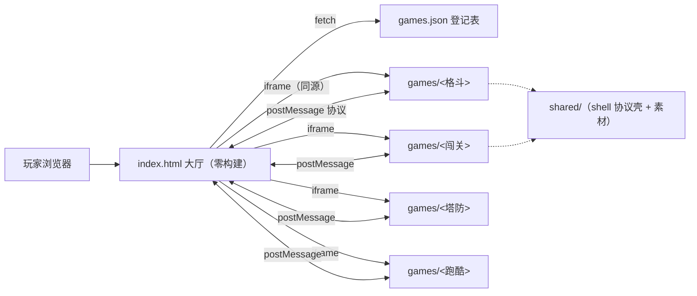

# 技术框架定稿（ADR）

> [!info] 状态
> 2026-10-04 应负责人委托定稿。推翻本决策需组内讨论后修订本页并更新修订记录。

## 背景与目标

- 程序员爱好小组，围绕 DeepSeek 拟人形象（鲸鱼娘）做小游戏合集
- 已规划类型：格斗 / 闯关 / 植物大战僵尸式塔防 / 跑图逃生，后续可能追加
- 多人并行独立开发，成员水平与投入节奏不一，可能有人中途弃坑
- **硬性目标：所有人的作品整合进同一个网页（一个大厅）**

核心判断：这个项目真正的技术风险**不在游戏引擎选型，而在多人整合**。框架设计的第一目标是把"整合成本压到≈0、一个人的问题不炸全场"。

## 决策一览

| 层面 | 决策 | 核心理由 |
| --- | --- | --- |
| 整合架构 | 零构建静态大厅 + 同源 iframe 岛 + postMessage 协议 | 故障隔离、各游戏技术自由、整合成本≈0 |
| 游戏技术栈 | 各游戏自选；默认推荐 Phaser 3（CDN 引入零构建可用）；产物必须是纯静态 `index.html` | 四类玩法 Phaser 全覆盖，教程生态最大，不强制所有人学同一框架 |
| 大厅 | 原生 HTML/CSS/JS，零构建零依赖 | 任何人一条静态服务命令即可跑起来看全部游戏 |
| 游戏登记 | 根目录 `games.json` 清单驱动，大厅动态渲染卡片 | 新增游戏 = 复制模板文件夹 + 登记一行 |
| 仓库布局 | 单仓 monorepo，每个游戏独占 `games/<id>/` | 目录即归属，天然无合并冲突 |
| 部署 | 整仓作为静态站点；推荐 GitHub Pages | 零成本、零服务端、可整体搬迁 |
| 数据 | 大厅 localStorage 存各游戏最高分；无后端 | 爱好项目不养服务器 |
| 共享层 | `shared/js/bluefish-shell.js`（协议壳单点实现）+ `shared/assets/`（形象素材包，待产出） | 协议不靠各游戏手写重复代码；形象统一靠共享素材 |

## 架构

协议与接入的完整细节（消息表、BFShell API、自测清单）→ [[游戏接入指南]]。

## 为什么不是别的方案

- **单引擎单页整合（所有人必须用 Phaser，各游戏 = 一个 Scene）**：强制统一框架与依赖版本，任何人升级依赖都可能炸全场；共享一个 JS 运行时，一处未捕获异常整个大厅崩溃；所有人耦合同一套构建配置，合并冲突频繁；想用别的引擎/纯 canvas 的人被卡死。否决。
- **Module Federation 微前端**：需要全员统一构建链和版本协商，复杂度远超一个游戏合集的需要。否决。
- **外链清单页（各游戏各自部署，大厅只放跳转链接）**：不满足"整合到一个网页"的体验目标，且每人各找托管成本高。否决。
- iframe 方案的代价（共享代码需经消息协议传递、深嵌 UI 集成弱）对游戏合集场景基本无感——游戏本来就是独立全屏画布。

## 风险与对策

| 风险 | 对策 |
| --- | --- |
| 各游戏形象画风不统一 | `shared/assets/` 统一素材包 + 美术规范文档（待立项）；接入指南列为硬性要求 |
| GitHub Pages 国内访问不稳 | 架构上整仓就是纯静态目录，可随时整体迁到 Cloudflare Pages / 自有服务器 nginx，代码零改动 |
| iframe 的性能开销 | 大厅同一时刻只开一个游戏，开销可忽略；关模态即销毁 iframe |
| 某游戏失控吃满 CPU/内存 | iframe 天然隔离，关掉即回收，不影响大厅与其他游戏 |
| 手柄/指针锁定在 iframe 内失效 | 大厅已为 iframe 配 `allow="gamepad *; fullscreen *; pointer-lock *"`，无需各游戏处理 |

## 修订记录

- 2026-10-04 初版定稿：iframe 岛架构 + games.json 清单 + bluefish-shell 协议壳 + 零构建大厅，并落地 v0 脚手架（大厅 + 示例游戏 whale-run）
