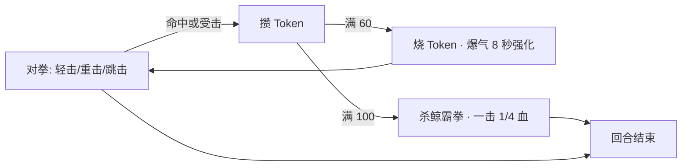

# 鲸鱼娘格斗游戏设计案（暂定名《杀鲸霸拳》）

> [!info] 状态：已立项开发（M0 通过）
> 2026-10-05 用户拍板开工：主角**鲸鱼娘**（形象基准 `assets/鲸鱼娘.jpg`），反派定为**蓝发西装形象**（基准 `assets/反派1.jpg`，占位名「蓝总」），取消四人挑战线、改单一宿敌 BO3。数值 v0 与共槽资源模型按推荐项执行，游戏名/id 仍为暂定，发布前定稿（留痕见 §16）。

## 1. 概述

| 项 | 内容 |
| --- | --- |
| 一句话 | 操纵鲸鱼娘打 1v1 格斗，攒 Token 烧爆气、满槽出杀鲸霸拳 |
| 类型 | 2D 单挑格斗（街机式） |
| 形态 | 大厅 iframe 岛：`games/whale-fist/`（id 暂定），纯静态，`type: "fighting"` |
| 模式 | 单人 vs CPU 挑战制（本地双人列入远期可选） |
| 形象基准 | `assets/鲸鱼娘.jpg`（仓库根，已放置；后续是否移入 `shared/assets/` 待定） |
| 设计分辨率 | 1280×720（16:9，与大厅统一） |

主题立意：蓝鲸 = DeepSeek 拟人形象，Token = 大模型的燃料。**格斗游戏的"气槽"在本作里就是 Token 槽**——打人挨打都在攒 token，爆气就是把攒下的 token 一次烧掉换爆发力，必杀则是"烧穿整条上下文"的一拳。所有系统机制尽量贴这个梗，而不是贴皮。

## 2. 核心循环



资源张力：Token 槽同时是爆气和必杀的燃料——**烧 60 换 8 秒节奏压制，还是憋到 100 赌一拳翻盘**，是本作的核心决策点。

## 3. 对局结构

- 单挑 BO3（先胜 2 回合者赢一场对局），每回合 60 秒
- 超时按剩余 HP 高者胜该回合；回合间回满 HP、清空 Token 槽
- 宿敌战：全程只打**蓝总**一个 BO3，回合难度递进（R1 试探 → R2 认真 → R3 解锁爆气），败北即结算
- 大厅分数口径（`BFShell.gameOver`）：`score = 回合胜场 × 1000 + 获胜回合剩余 HP`；败北也按已胜回合计分

## 4. 操作（默认键位，后续可配置）

| 输入 | 键 | 说明 |
| --- | --- | --- |
| 移动 / 跳跃 | A / D / W | 左右移动、跳跃；无下蹲（裁剪项，见 §15） |
| 防御 | S | 按住站防，减伤 80% |
| 轻击 | J | 快、伤害低、攒 Token 快 |
| 重击 | K | 慢、伤害高、破防削 |
| 爆气（烧 Token） | I | Token ≥ 60 时可用 |
| 杀鲸霸拳 | U | Token = 100（满槽）时可用 |
| 暂停 | P / Esc | 走大厅协议暂停 |

## 5. 战斗系统

2D 平面格斗，地面单线 + 跳跃，朝向自动面对对手。帧数按 60fps 计。

| 招式 | 伤害 | 前摇/活动/后摇（帧） | 命中 Token | 备注 |
| --- | --- | --- | --- | --- |
| 轻击 | 40 | 4 / 3 / 8 | +8 | 连点可形成轻连段 |
| 重击 | 70 | 10 / 4 / 16 | +14 | 击退大，命中可接跳击 |
| 跳击 | 50 | 空中 6 / 5 / 落地 8 | +10 | 跳跃下落中按下攻击键 |
| 防御 | ×0.2 | — | +3/次 | 被必杀命中时防御减伤后仍有击退 |
| 受击 | — | 硬直 10（轻）/ 18（重） | +6/次 | 被打也攒 Token，保底有反击资源 |

受击硬直、击飞、倒地起身（无敌 30 帧）走标准街机简化模型；无投技、无上/中段择（MVP 裁剪，见 §15）。

## 6. Token 资源系统

- Token 槽上限 **100**，HUD 显示为一条"上下文窗口"样式的槽（烧掉的部分变灰烬动画）
- 获取途径：命中招式（§5 表）、受击、防御成功；**无自然回涨**——token 必须靠交互挣
- 两个消耗去向互斥地吃同一条槽：
  - **爆气（烧 Token）**：消耗 60
  - **杀鲸霸拳**：消耗 100（必须满槽）

## 7. 爆气 · 烧 Token

| 项 | 规格（草案） |
| --- | --- |
| 消耗 | 60 Token |
| 效果 | 立即解除自身受击硬直/击飞状态；8 秒内攻击 ×1.3、移速 ×1.15、**霸体**（受击不硬直不击退，伤害照常） |
| 演出 | 角色周身蓝焰裹身，HUD 的 token 数字快速滚动烧掉；背景弹出一行小字跑马灯：`burning tokens...` |
| 反制 | 霸体仍掉血——对方可以硬换或拉开距离拖过 8 秒 |

设计意图：爆气是**节奏资源**，用于打破被压制的局面或斩杀期抢伤害；解控属性让它兼作"受身逃逸"键，给新手一个保底翻身技。

## 8. 必杀 · 杀鲸霸拳

| 项 | 规格（草案） |
| --- | --- |
| 条件 | Token = 100（满槽），按 U 发动 |
| 性能 | 前摇 18 帧（蓄力pose）→ 突进约 0.3 秒（距离约屏宽 40%）→ 挥拳；命中 **250 伤害** + 大击飞；被防御时伤害 100 |
| 风险 | 空挥/被跳过 → 45 帧大硬直，必吃一套反击 |
| 演出 | 命中瞬间黑屏特写：鲸鱼娘挥拳 + 蓝鲸虚影随拳冲出（像被鲸尾拍中）+ 屏幕闪白 + `深度思考中……` 一闪而过 → 恢复战斗 |

设计意图：满槽一拳 ≈ 1/4 血，是翻盘刀也是止损刀；前摇可被读、空挥重罚，保证它是对拼决策而不是无脑按键。

## 9. 角色与对手（提案，全部待批）

- **鲸鱼娘**（玩家）：均衡型。形象基准 `assets/鲸鱼娘.jpg`——2~3 头身 chibi、蓝渐变长卷发+头顶水柱状呆毛、耳侧鲸鳍翼、白色蕾丝发箍蓝蝴蝶结、深藏青女仆裙+白围裙（中央鲸鱼印花）、裙后大鲸尾。简化小人必保特征：**呆毛卷钩、鲸尾、鳍翼、发箍+围裙**
- **蓝总**（反派，占位名）：形象基准 `assets/反派1.jpg`——蓝色刺猬乱发遮右眼、锐利蓝眼、苍白肤、黑西装+白衬衫+宝蓝领带（略松歪），白色星形粒子飘散是其画面标志（游戏内作为他的环绕粒子/爆气特效）。必保特征：**乱发遮右眼、蓝领带**
- 出招演出彩蛋：蓝总出重招前一瞬间头顶冒 `服务器繁忙，请稍后再试` 微型气泡——既是梗也是 telegraph（预警提示）
- 2026-10-05 拍板：取消原四人挑战线提案（木桩鲸/水雷君/鲨鱼佬/墨总，见修订记录），改单一宿敌制

## 10. AI 对手行为

- 状态机：接近 / 拉开 / 出招选择 / 防御 / 跳避 / 爆气决策，参数随回合递进（R1/R2/R3）
- 难度递进：反应帧 16/12/8，防御率 10%/25%/45%，进攻欲 0.5/0.7/0.9；R3 蓝总解锁爆气（劣势或玩家爆气时会反烧 token）
- **蓝总没有杀鲸霸拳**（非对称设计：他只会烧 token 抢节奏，玩家才憋得住那一拳）；玩家满槽时 AI 提高跳避概率，制造"憋霸拳要择时"的博弈

## 11. 美术与演出方向

- M2 决策：**程序矢量绘制**（纯 Canvas 代码画 chibi，零素材依赖、离线可用、改配色零成本），sprite/骨骼化列为后续升级项
- 打击感三件套（M1 灰盒就要有，不留给最后）：命中停顿（轻 3 帧 / 重 6 帧 / 必杀 12 帧）、分级震屏、命中火花粒子
- 角色形象统一走 `shared/assets/` 素材包规划（见 [[技术框架定稿]] 风险表），本作是素材包的第一个推动方
- 场景：深海渐进（海面训练场 → 浅海 → 深海 → 海渊斗技场），背景视差两层即可

## 12. 音频

- M2 决策：音效全部 **WebAudio 程序合成**（零音频文件、无版权问题）。清单：轻/重/跳击命中、受击、防御、挥空、跳跃、爆气点燃、必杀蓄力/命中、KO、回合开始、UI、胜利/失败——约 13 个
- BGM 后议（合成 BGM 投入大，v1 可无 BGM）
- 注意浏览器自动播放限制（见 [[游戏接入指南]] 常见坑）：开始画面先吃一次按键

## 13. 技术实现

- 引擎：**纯 Canvas 2D 自研**（与示例游戏 whale-run 同路线；格斗判定需要完全自控的固定帧循环，且零 CDN 依赖最稳——留痕 2026-10-05，若后续需要场景/粒子中间件再评估 Phaser）
- 目录：`games/whale-fist/`，入口 `index.html` 引 `../../shared/js/bluefish-shell.js`
- 固定 60fps 步长更新；帧数据（§5/§8 全表）外置为 `js/data.js` 纯 JS 数据文件（免 fetch/file:// 兼容问题），改数值不动代码
- 模块：`fighter.js`（纯逻辑无 DOM）/ `ai.js` / `fx.js`（顿帧·震屏·粒子）/ `art.js`（角色矢量绘制）/ `audio.js`（合成音效）/ `main.js`（场景·输入·HUD·循环）
- BFShell 集成点：`ready()` / `score(n)`（回合胜利时上报）/ `gameOver({score, win})` / `onPause`/`onResume` / `fitCanvas(1280×720)` / 退出按钮 `exit()`
- games.json 登记（草案行）：

```json
{"id":"whale-fist","title":"杀鲸霸拳（暂定）","author":"（你）","type":"fighting",
 "entry":"games/whale-fist/index.html","aspect":"16:9",
 "description":"鲸鱼娘 1v1 格斗：攒 Token 爆气，满槽杀鲸霸拳一击制胜。","controls":"AD 移动 W 跳 S 防御 J/K 攻击 I 爆气 U 必杀","order":10}
```

## 14. 里程碑

| 阶段 | 内容 | 完成判据 |
| --- | --- | --- |
| M0 | 本设计案评审拍板 | 待拍板清单清零 |
| M1 灰盒对战 | 全招式 + Token/爆气/必杀 + 蓝总三段 AI + 打击感三件套，矩形占位角色 | 内部可玩，完整打赢/打输一局 |
| M2 形象接入 | 程序矢量 chibi（两角色）+ 合成音效 + 接入大厅 | 自测清单全过 |
| M3 演出打磨 | 必杀特写 cut-in、爆气火焰、结算画面、难度手感调优 | 全流程体验完整 |
| M4（可选） | 本地双人同屏、键位配置、成就式最高分细化 | 另立小设计案 |

## 15. 范围裁剪与风险

**MVP 明确不做**（写明防止范围膨胀）：下蹲与上下段择、投技、连段取消、格挡反弹、网络对战、角色切换（只有鲸鱼娘可选）。

| 风险 | 对策 |
| --- | --- |
| 格斗手感调优是无底洞 | 帧数据全外置 JSON，M1 起以"好玩"为唯一验收，数值先糙后精 |
| 骨骼动画学习成本高 | 帧动画 sprite 是保底方案，M2 前小试一次再定 |
| 美术素材量大（角色 ×5 + 场景 ×4） | 对手先复用主角骨架换色；素材统一沉淀进 `shared/assets/` 供后续游戏复用 |
| 单文件游戏逻辑膨胀 | `frame-data.json` + 场景/角色参数全部数据驱动，代码只留引擎逻辑 |

## 16. 拍板与留痕

> [!info] 2026-10-05 用户拍板"开始做"
> 1. ✅ **阵容**（用户明示）：主角鲸鱼娘、反派蓝发西装形象（`assets/反派1.jpg`），单一宿敌 BO3，取消四人挑战线
> 2. ⏳ **游戏名**：按推荐《杀鲸霸拳》**暂定**执行、id `whale-fist`，发布前定稿——留痕，未终批
> 3. ✅ **数值基准**：随开工指令按 v0 表进入 M1，后续试玩调（数据全外置 `js/data.js`）
> 4. ✅ **共槽互斥资源模型**：按推荐执行（60 爆气 / 100 必杀）
> 5. ✅ **双人模式**：M4 可选，不进 MVP
> 6. ⏳ **基准图处置**：`assets/` 两张基准图暂留原位，`shared/assets/` 素材包立项时再议
> 7. 📌 工程留痕：引擎由草案的 Phaser 3 改为纯 Canvas 自研（理由见 §13）；帧数据载体由 JSON 改为 `js/data.js`；美术定为程序矢量绘制、音效定为 WebAudio 合成（见 §11/§12）

## 修订记录

- 2026-10-05 M0 通过开工：反派定蓝发西装单宿敌制（占位名蓝总），取消四人挑战线；数值/资源模型按推荐执行；引擎改纯 Canvas、美术改程序矢量、音效改 WebAudio 合成（工程留痕见 §16）
- 2026-10-04 初版草案：立项背景、核心循环、Token/爆气/必杀三系统、对手挑战线、里程碑与待拍板清单
